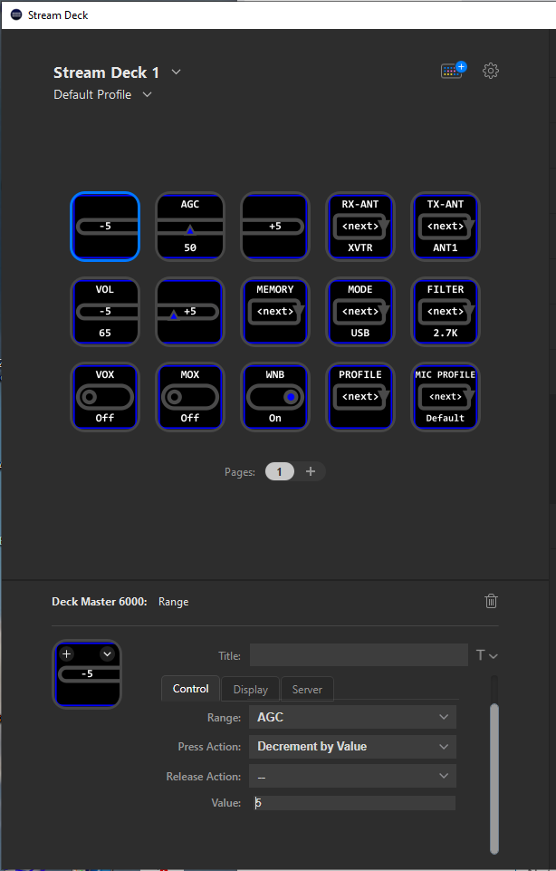

# Deck Master 6000 
v1.0.0

&nbsp;&nbsp;&nbsp;&nbsp;&nbsp;&nbsp;*Donald Beaudry (K1DBO)*  
&nbsp;&nbsp;&nbsp;&nbsp;&nbsp;&nbsp;*June 2023*

StreamDeck plug-in for FlexRadio's Flex-6000 series radios

---

Connect to [Slice Master 6000's](https://github.com/k1dbo/slice-master-6000) HRD TCP Listeners to control your FlexRadio FLEX-6000 series radios with any Elgato StreamDeck, including the Stream Deck +, and Stream Deck Pedal.

All displays are dynamic and supoprt customizable background colors, images, adjustable fonts.

Setup is easy.  Just download the plug-in from the [releases page](https://github.com/k1dbo/deck-master-6000/releases) and double click to install.

Once installed, you can choose Toggle, Range, and Choice controls and add them to any button.  

If you are using a Stream Deck +, you can also choose from two different dial variations: Range/Choice or Range/Toggle.  Each require you to choose a Range to be adjusted by the knob but you can optionally choose a Toggle or Choice to be controlled by pressing the knob or touching the knob display.  This is great for combining related functions, like mute and volume, onto a single knob.

The connection to Slice Master is controled by the Server tab for each control.  But note that all controls share the same connection.  The default configuration assumes that Slice Master is listening for connection on port 7810 and is running on the same computer as the plug-in.  So to get the plug-in going, all you'll need to do is start up Slice Master and check its settings tab for the HRD TCP TX Listener to make sure that it is enabled and running on port 7810.

Here are a few examples of what you can expect to see.

This plug-in is still under development but it's time for some community feedback.
